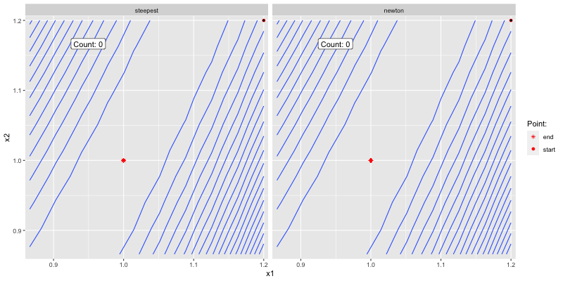
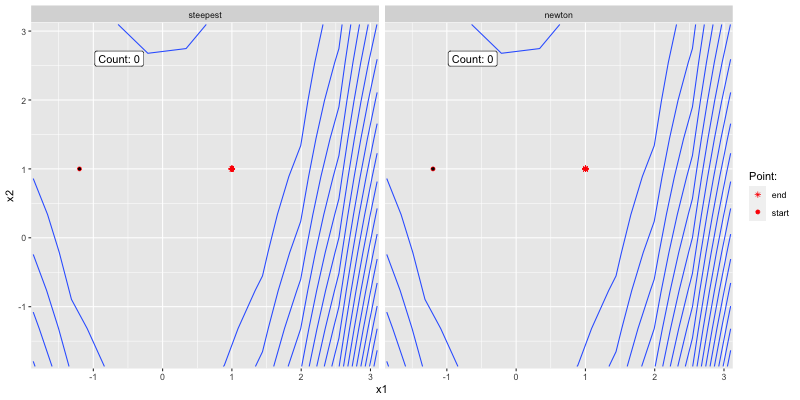

# Deterministic optimization {#det-opt}

## Line search 

### Methodology

```{r, echo=F}
library(data.table)
X_range = seq(-1.5,1.5,0.1)
X0 = data.table(x1=c(1.2,-1.2),
                x2=c(1.2,1),
                label=c("(1)","(2)"))
```

The goal of Exercise 3.1 in @nw2006numerical is to minimize the bivariate Rosenbrock function (Equation \@ref(eq:rosenbrock)) using *steepest descent* and *Newton's method*. The Rosenbrock function - also known as *Rosenbrock's banana function* - has a long, narrow, parabolic shaped flat valley and is often used for to test optimization algorithms for their performance (see [here](https://en.wikipedia.org/wiki/Rosenbrock_function)).

$$
\begin{equation}
  f(\mathbb{x})=100(x_2-x_1^2)^2+(1-x_1)^2 
  (\#eq:rosenbrock)
\end{equation}
$$
We can implement Equation \@ref(eq:rosenbrock) in R as follows:

```{r}
# Rosenbrock:
f = function(X) {
  100 * (X[2] - X[1]^2)^2 + (1 - X[1])^2
}
```

Figure \@ref(fig:rosenbrock) shows the output of the function over $x_1,x_2 \in [`r min(X_range)`, `r max(X_range)`]$ along with its minimum indicated as a red asterisk and the two starting points: (1) $X_0=(1.2,1.2)$ and (2) $X_0=(-1.2,1)$. 

```{r rosenbrock, fig.cap="Output of the Rosenbrock function and minimizer in red."}
library(ggplot2)
# Plot
grid = data.table(expand.grid(x1=X_range,x2=X_range))
grid[,y:=f(c(x1,x2)),by=.(1:nrow(grid))]
X_min = grid[y==min(y),.(x1,x2)]
p = ggplot() +
  geom_contour_filled(data = grid, aes(x=x1,y=x2,z=y)) +
  geom_point(data = X_min, aes(x=x1,y=x2), colour="red", shape=8) +
  geom_point(data = X0, aes(x=x1,y=x2), colour="red") + 
  geom_text(data = X0, aes(x=x1,y=x2,label=label), colour="red", nudge_x = 0.1, nudge_y = 0.1)
p
```

The gradient and Hessian of $f$ can be computed as

$$
\begin{equation}
\nabla f(\mathbb{x})= \begin{pmatrix}
\frac{ \partial f}{\partial x_1} \\
\frac{ \partial f}{\partial x_2}
\end{pmatrix} 
(\#eq:d-rosenbrock)
\end{equation}
$$

and 

$$
\begin{equation}
\nabla^2 f(\mathbb{x})= \begin{pmatrix}
\frac{ \partial^2 f}{\partial x_1^2} & \frac{ \partial^2 f}{\partial x_1 \partial x_2} \\
\frac{ \partial^2 f}{\partial x_2\partial x_1} & \frac{ \partial^2 f}{\partial x_2^2}
\end{pmatrix}
(\#eq:dd-rosenbrock)
\end{equation}
$$

which in R can be encoded as follows:

```{r}
# Gradient:
df = function(X) {
  df = rep(0, length(X))
  df[1] = -400 * X[1]^2 * (X[2] - X[1]^2) - 2 * (1 - X[1]) # partial with respect to x_1
  df[2] = 200 * (X[2] - X[1]^2)
  return(df)
}

# Hessian:
ddf = function(X) {
  ddf = matrix(nrow = length(X), ncol=length(X))
  ddf[1,1] = 1200 * X[1]^2 - 400 * X[2] + 2 # partial with respect to x_1
  ddf[2,1] = ddf[1,2] = -400 * X[1]
  ddf[2,2] = 200
  return(ddf)
}
```

For both methods I will use the *Arminjo condition* with backtracking. The `gradient_desc` function (below) can implement both *steepest descent* and *Newton's method*. The code for the function can be inspected below (you can reveal it by simply clicking on the *Code* button on the right). There's also a small description of the different arguments.

```{r code=readLines("R/gradient_desc.R"), eval=F}
```

Similarly you can take a look at how the `gradient_desc` is applied in the underlying problem by unhiding the next code chunk.

```{r, eval=F}
source("R/gradient_desc.R")
init_guesses = 1:nrow(X0)
algos = c("steepest","newton")
grid = expand.grid(guess=init_guesses,algo=algos)
X_star = lapply(
  1:nrow(grid),
  function(i) {
    gradient_desc(
      f=f,df=df,
      X0=X0[grid[i,"guess"],c(x1,x2)],
      method = grid[i,"algo"]
    )
  }
)
# Tidy up
X_star_dt = rbindlist(
  lapply(
    1:length(X_star), 
    function(i) {
      dt = data.table(X_star[[i]]$visited)
      dt[,method:=X_star[[i]]$method]
      dt[,(c("x0_1","x0_2")):=.(X_star[[i]]$X0[1],X_star[[i]]$X0[2])]
      dt[,iteration:=.I-1]
      dt[,y:=f(c(V1,V2)),by=.(1:nrow(dt))]
    }
  )
)
```

### Results 

The below shows how the two algorithms converge to

```{r, fig.cap="Good initial guess."}
if (knitr:::is_html_output()) {
  
}
```

```{r, fig.cap="Poor initial guess."}
if (knitr:::is_html_output()) {
  
}
```


```{r p1, eval=F}
library(gganimate)
library(transformr)
library(gridExtra)
chart_dt = X_star_dt[x0_1==X0[1,x1] & x0_2==X0[1,x2]]
# Data for descent path:
desc_dt = chart_dt[,keep:=iteration%in%iteration[unique(floor(seq(1, .N, length.out = 10)))],by=.(method)][keep==T][,keep:=NULL]
desc_dt[,state:=1:.N,by=.(method)]
# Data for function values (contour plot):
X_seq = desc_dt[,.(seq={
  X_range = range(c(V1,V2))
  X_seq = seq(X_range[1],X_range[2],length.out = 10)
})]$seq
contour_dt = desc_dt[,expand.grid(V1=X_seq,V2=X_seq),by=.(method)]
contour_dt[,y:=f(c(V1,V2)),by=.(1:nrow(contour_dt))]
# Data for initial guesses and optimum:
start_dt = unique(chart_dt[,.(method,x1=x0_1,x2=x0_2)])
start_dt[,which:="start"]
end_dt = X_min[,.(method = start_end_dt$method, x1, x2,which="end")]
start_end_dt = rbind(start_dt,end_dt)
p = ggplot() +
  # Contour plot:
  geom_contour(
    data = contour_dt,
    aes(x=V1, y=V2, z=y),
    bins = 20
  ) +
  # Start:
  geom_point(
    data=start_end_dt,
    aes(x=x1, y=x2, shape=which),
    colour="red"
  ) +
  # Descent path:
  geom_point(
    data = desc_dt,
    aes(x=V1, y=V2),
    colour="black",
    size=0.75
  ) +
  # Iteration count:
  geom_label(
    data = desc_dt,
    aes(x=min(X_seq), y=max(X_seq), label=paste0("Count: ",iteration)),
    nudge_x=diff(range(X_seq))*0.25,
    nudge_y=-diff(range(X_seq)*0.1)
  ) +
  # Formatting:
  scale_y_continuous(
    expand = c(0.005,0.005)
  ) +
  scale_x_continuous(
    expand = c(0.005,0.005)
  ) +
  labs(
    x="x1",
    y="x2"
  ) +
  scale_shape_manual(
    name="Point:",
    values=c(8,19)
  ) +
  # Facetting:
  facet_grid(
    cols = vars(method)
  ) +
  # Animation:
  transition_states(
    desc_dt$state,
    transition_length = 2,
    state_length = 1
  ) +
  enter_fade() +
  ease_aes('sine-in-out') +
  shadow_trail(distance = 0.05)
anim_save("www/p1.gif",p, width = 800, height = 400)
```

```{r p2, echo=F, eval=F}
chart_dt = X_star_dt[x0_1==X0[2,x1] & x0_2==X0[2,x2]]
# Data for descent path:
desc_dt = chart_dt[,keep:=iteration%in%iteration[unique(floor(seq(1, .N, length.out = 10)))],by=.(method)][keep==T][,keep:=NULL]
desc_dt[,state:=1:.N,by=.(method)]
# Data for function values (contour plot):
X_seq = desc_dt[,.(seq={
  X_range = range(c(V1,V2))
  X_seq = seq(X_range[1],X_range[2],length.out = 10)
})]$seq
contour_dt = desc_dt[,expand.grid(V1=X_seq,V2=X_seq),by=.(method)]
contour_dt[,y:=f(c(V1,V2)),by=.(1:nrow(contour_dt))]
# Data for initial guesses and optimum:
start_dt = unique(chart_dt[,.(method,x1=x0_1,x2=x0_2)])
start_dt[,which:="start"]
end_dt = X_min[,.(method = start_end_dt$method, x1, x2,which="end")]
start_end_dt = rbind(start_dt,end_dt)
p = ggplot() +
  # Contour plot:
  geom_contour(
    data = contour_dt,
    aes(x=V1, y=V2, z=y),
    bins = 20
  ) +
  # Start:
  geom_point(
    data=start_end_dt,
    aes(x=x1, y=x2, shape=which),
    colour="red"
  ) +
  # Descent path:
  geom_point(
    data = desc_dt,
    aes(x=V1, y=V2),
    colour="black",
    size=0.75
  ) +
  # Iteration count:
  geom_label(
    data = desc_dt,
    aes(x=min(X_seq), y=max(X_seq), label=paste0("Count: ",iteration)),
    nudge_x=diff(range(X_seq))*0.25,
    nudge_y=-diff(range(X_seq)*0.1)
  ) +
  # Formatting:
  scale_y_continuous(
    expand = c(0.005,0.005)
  ) +
  scale_x_continuous(
    expand = c(0.005,0.005)
  ) +
  labs(
    x="x1",
    y="x2"
  ) +
  scale_shape_manual(
    name="Point:",
    values=c(8,19)
  ) +
  # Facetting:
  facet_grid(
    cols = vars(method)
  ) +
  # Animation:
  transition_states(
    desc_dt$state,
    transition_length = 2,
    state_length = 1
  ) +
  enter_fade() +
  ease_aes('sine-in-out') +
  shadow_trail(distance = 0.05)
anim_save("www/p2.gif",p, width = 800, height = 400)
```

