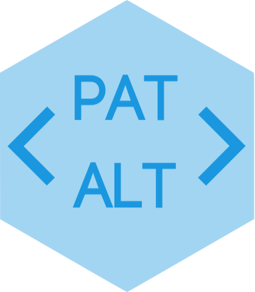

# About the Author {-}

I am an economist by background with a strong interest in cross-disciplinary research on the intersection of interpretable artificial intelligence (AI), causal inference, economics and finance. Currently I am studying for the MSc Data Science at the Barcelona Graduate School of Economics. I am also affiliated with the Bank of England where I previously worked as an economist mainly focused on monetary policy briefings, research and market intelligence.

<a href="https://pat-alt.github.io/about/">
  
</a>
