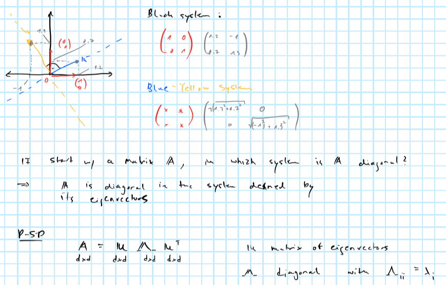

# Dimensionality reduction {#dim-red}

Let $X_1,...,X_n\in\mathbb{R}^p$ be our high-dimensional data. We want to project the data onto a lower-dimensional space, that is we want $q<<p$ and $f:\mathbb{R}^p \mapsto \mathbb{R}^q$ such that $||f(X_i)-f(X_j)|| \approx ||X_i-X_j||$ -- the distance between any two points in the lower-dimensional space should be close to their corresponding distance in the original space. We can respecify the problem as

$$
\begin{aligned}
&& \max_{i,j\le n}\left| \frac{||f(X_i)-f(X_j)||^2}{||X_i-X_j||^2}-1\right|&\le \varepsilon\\
\end{aligned}
$$

where $\varepsilon$ is some desired accuracy.

## Random projections

```{lemma, john-lin, name="Johnson-Lindestrauss"}
Given $X_1,...,X_n\in\mathbb{R}^p$ there exists a (possibly linear) mapping $f:\mathbb{R}^p \mapsto \mathbb{R}^q$ such that 

$$
\max_{i,j\le n}\left| \frac{||f(X_i)-f(X_j)||}{||X_i-X_j||}-1\right|\le \varepsilon
$$

whenever $q\ge \frac{8}{\varepsilon^2} \log n$.
```

Let $f(X)=WX$, $X\in\mathbb{R}^p$, $W$ $(q\times p)$ and for the elements of $W$: $w_{ij} \sim \mathcal{N}(0, \frac{1}{p})$ are idd. First note that

$$
\begin{aligned}
&& \mathbb{E}||f(X)||^2&= \mathbb{E} ||W X||^2= \mathbb{E} \sum_{i=1}^{q} \left( \sum_{j=1}^{p} X_jW_{i,j}\right)^2\\
&& &= \sum_{i=1}^{q}\mathbb{E}  \left( \sum_{j=1}^{p} X_jW_{i,j}\right)^2= \sum_{i=1}^{q} \frac{||X||^2}{q}\\
\end{aligned}
$$

where the last equality follows from $\sum_{j=1}^{p} X_jW_{i,j} \sim \mathcal{N}(0, \frac{1}{q}\sum_{j=1}^{p} X_j^2 ) = \sim \mathcal{N}(0,\frac{||X||^2}{q})$. Then finally:

$$
\begin{aligned}
&& \mathbb{E}||f(X)||^2&=||X||^2 \\
\end{aligned}
$$
Now in particular for any $i,j\le n$

$$
\begin{aligned}
&& \mathbb{E}||f(X_i)-f(X_j)||^2&= \mathbb{E}||W(X_i-X_j)||^2=||X_i-X_j||^2 \\
\end{aligned}
$$

Now for the actual proof:

```{proof}
We want to show that 

$$
\begin{aligned}
&& \max_{i,j\le n}\left| \frac{||f(X_i)-f(X_j)||^2}{||X_i-X_j||^2}-1\right|&\le \varepsilon\\
\end{aligned}
$$

with high probability. Note that we can rewrite

$$
\begin{aligned}
&& \frac{||f(X_i)-f(X_j)||^2}{||X_i-X_j||^2}&= ||W \left( \frac{X_i-X_j}{||X_i-X_j||}\right)||^2 \\
\end{aligned}
$$

where $||\frac{X_i-X_j}{||X_i-X_j||}||=1$. Denote $b=\frac{X_i-X_j}{||X_i-X_j||}$, then we have

$$
\begin{aligned}
&& ||Wb||^2-1&=\sum_{i=1}^{q}  \left( \sum_{j=1}^{p} W_{i,j} b_j\right)^2 -1=\sum_{i=1}^{q} N_i^2-1\\
\end{aligned}
$$

with $N_i=\sum_{j=1}^{p} W_{i,j} b \sim \mathcal{N}(0, \frac{1}{d})$
```


## PCA

One of the most straight-forward ways to reduce model dimensionality is principal component analysis (PCA). Very loosely defined principal components can be thought of as describing the main sources of variation in the data. While in theory any design matrix $X$ $(n \times p)$ can be decomposed into its principal components, in practice PCA can be more or less useful for dimensionality reduction depending on how the $p$ different features in $X$ related to each other. We will see that in particular for highly correlated data PCA can be an extremely useful tool for dimensionality reduction.

### The maths behind PCA

PCA projects $X$ into a $q$-dimensional space where $q \le p$, such that the covariance matrix of the $q$-dimensional projection is maximised. Intuitively, we want to find the linear combination of points in $X$ which explains the largest part of the variance in $X$. Formally (in a very stylised fashion) this amounts to

$$
\begin{aligned}
&& \max_a& \left( \Omega = P_1^TP_1 = v^TX^TXv = v^T \Sigma v \right) \\
\text{s.t.} && v^Tv&= \mathbf{1} && \text{(loading vector)} \\
\text{where}&& P_1 &= v^T X && \text{(principal component)} \\
\end{aligned}
$$

where $v$ is given by the eigenvector corresponding to the largest eigenvalue of $\Sigma$ - the covariance matrix of $X$. We can eigen-decompose $\Sigma$

$$
\begin{aligned}
&& \Sigma&= V \Lambda V^{-1} \\
\end{aligned}
$$

where $\Lambda$ is a diagonal matrix of eigenvalues in decreasing order.

Sometimes eigenvectors $V$ are referred to as rotation vectors: the first eigenvector - i.e. the one corresponding to the highest eigenvalue - rotates the data into the direction of the highest variation. Remembers this image from the brush-ups?



### An intuitive example

PCA can be applied very well to highly correlated time series. Take for example US treasury yields of varying maturities over time: they are intrinsically linked to each other through the term-structure of interest rates. As we will see the first couple of principal components have a very intuitive interpretation when applied to yield curves.

```{r}
library(data.table)
library(ggplot2)
dt <- fread("data/ust_yields.csv")
dt_long <- melt(dt, id.vars = "Date")
ggplot(data=dt_long, aes(x=Date, y=value, alpha=variable)) +
  geom_line() +
  scale_alpha_discrete(
    name="Maturity:"
  ) +
  labs(
    x=NULL,
    y="Per cent"
  ) 
```

Let's perform PCA through spectral decomposition in R and look at the output. 

```{r}
X <- as.matrix(na.omit(dt[,-1]))
Sigma <- crossprod(X)
sdc <- eigen(Sigma)
V <- sdc$vectors
pct_var <- data.table(percent=sdc$values/sum(sdc$values)*100)
knitr::kable(head(pct_var))
```

Let's compute the first three principal components and plot them over time. How can we make sense of this? It is not obvious and in many applications interpreting the components at face value is a difficult task. In this particular example it turns out that we can actually make sense of them.

```{r}
# Retrieve first 3 principal components:
P_3 <- X %*% V[,1:3]
# Plot them:
pc_dt <- data.table(date = na.omit(dt)$Date, P_3)
pc_dt <- melt(pc_dt, id.vars = "date")
ggplot(data=pc_dt, aes(x=date, y=value, alpha=variable)) +
  geom_line() +
  scale_alpha_discrete(
    name="Principal component:"
  ) +
  labs(
    x=NULL,
    y="Value"
  ) 
```

Let's see what happens when we play with the components. (Shiny app not run in static HTML)

```{r eval=F}
library(shiny)
yc_0 <- rep(0.05,ncol(X))
range <- -10:10
shinyApp(
  
  # --- User Interface --- #
  
  ui = fluidPage(
    
    sidebarPanel(
      sliderInput("pc1", label = "PC1", min = min(range), max=max(range), value = 0),
      sliderInput("pc2",label = "PC2", min = min(range), max=max(range), value = 0),
      sliderInput("pc3",label = "PC3", min = min(range), max=max(range), value = 0)
    ),
    
    mainPanel(
      plotOutput("plot")
    )
    
  ),
  
  # --- Server logic --- #
  
  server = function(input, output) {
    output$plot <- renderPlot(
      {
        req(input$pc1)
        V_trans <- V %*% diag(c(input$pc1,input$pc2,input$pc3,rep(1,ncol(V)-3)))
        plot_dt <- data.table(n=1:ncol(V), value=c(V_trans %*% yc_0))
        ggplot(data=plot_dt, aes(x=n, y=value)) + 
          geom_point() +
          geom_line()
      }
    )
  }
  
)
```

## PCA for feature extraction

### Squared elements of eigenvectors

Consider again using the spectral decomposition of $\Sigma=\mathbf{X}^T\mathbf{X}$ to perform PCA:

$$
\begin{aligned}
&& \Sigma&= V \Lambda V^{T} \\
\end{aligned}
$$

A practical complication with PCA is that generally the principal components cannot be easily interpreted. If we are only interested in prediction, then this may not be a concern. But when doing inference, we are interested in the effect of specific features rather than the principal components that describe the variation in the design matrix  $\mathbf{X}$. It turns out that we can still use spectral decomposition to select features directly. The clue is to realize that the $i$-th squared element $v^2_{ji}$ of the $j$-th eigenvector can be though of as the percentage contribution of feature $i$ to the variation in the $j$-th principal component. Having already established above that eigenvalues provide a measure of how much of the overall variation in $X$ is explained by the $j$-th principal component, these two ideas can be combined to give us a straight-forward way to identify important features (for explaining variation in $\mathbf{X}$). In particular, compute $\mathbf{s}= \text{diag}\{\Lambda\}/ \text{tr} (\Lambda)$ $(p \times 1)$ where $\Lambda$ is diagonal matrix of eigenvalues and let $\mathbf{V}^2$ be the matrix of eigenvectors with each elements squared. Consider computing the following vector $\mathbf{r} \in \mathbb{R}^p$ which will use to rank our $p$ features:

$$
\begin{equation} 
\begin{aligned}
&& \mathbf{r}&=\mathbf{V}^2 \mathbf{s} \\
\end{aligned}
(\#eq:ranking)
\end{equation}
$$

By construction elements in $\mathbf{r}$ sum up to one so they can be thought of as percentages describing the overall importance of individual features *in terms of explaining the overall variation in the design matrix*. This last point is important: PCA never even looks at the outcome variable that we are interested in modelling. Even features identified as *not important* by PCA may in fact be very important for the model, so the ranking is merely a guideline of sorts.

```{r}
s <- sdc$values/sum(sdc$values)
r <- (V**2) %*% s
q <- 5
```

Then say we were interested in decreasing the number of features from $p=`r ncol(V)`$ to $q=`r q`$, then this approach suggests using the following features:

```{r}
ranking <- data.table(
  feature = colnames(dt)[-1],
  importance = c(r)
)
setorder(ranking, -importance)
knitr::kable(head(ranking,q))
```

### SVD

Instead of using spectral decomposition we could use (compact) SVD for PCA. *Compact* SVD works decomposes any matrix $X$ $(n \times p)$ as follows

$$
\begin{aligned}
&& X&= U S V^{T} \\
\end{aligned}
$$

where $S$ is diagonal $(p\times p)$, $U$ is $(n \times r)$ and $V$ is $(r \times p)$ with $r=\min(n,p)$. The diagonal elements of $S$ are referred to as singular values (*Note*: it turns out that they correspond to the square roots of the eigenvalues of $X^TX$). It is then easy to see that $V$ is once again the matrix of eigenvectors of $X^tX$ as above

$$
\begin{aligned}
&& \Sigma&=X^TX=(V^TS^TU^T)US V \\
&& &= V(S^TS)V^T=V\Lambda V^T\\
\end{aligned}
$$
where $U^TU=I$ by the fact that $U$ is orthogonal and from the note above it should be clear why $S^TS=\Lambda$.

```{r}
svd <- svd(X)
V <- svd$v
s <- svd$d/sum(svd$d)
r <- (V**2) %*% s
q <- 5
```

Unsurprisingly this gives us the equivalent ranking of features:

```{r}
ranking <- data.table(
  feature = colnames(dt)[-1],
  importance = c(r)
)
setorder(ranking, -importance)
knitr::kable(head(ranking,q))
```

## High-dimensional data

Now that we have developed a good intuition of PCA, it is time to face its shortfalls. While PCA can be used as tool to reduce dimensionality it is actually inconsistent for cases where $p>>n$. Enter: **regularized SVD**.

### Regularized SVD

@witten2009penalized propose a regularized version of SVD where the $L_1$-norm eigenvectors $\mathbf{v}_k$ is penalized. In particular the authors propose a modified version of the following optimization problem:

$$
\begin{equation} 
\begin{aligned}
&& \max_a& \left( \Omega = P_1^TP_1 = \mathbf{v}^TX^TX\mathbf{v} = \mathbf{v}^T \Sigma \mathbf{v} \right) \\
\text{s.t.} && \mathbf{v}^T\mathbf{v}&= \mathbf{1}  \\
&& |\mathbf{v}|& \le c \\
\end{aligned}
(\#eq:scotlass)
\end{equation}
$$

Note that this essentially looks like spectral decomposition with an added LASSO penality: consequently depending on the regularization parameter $c$ some elements of $\mathbf{v}_k$ will be shrinked to exactly zero and hence this form of penalized SVD is said yield sparse principal components. The optimization problem in \@ref(eq:scotlass) - originally proposed @jolliffe2003modified - is non-convex and hence computationally hard. @witten2009penalized propose to instead solve the following optimization problem:

$$
\begin{equation} 
\begin{aligned}
&& \max_a& \left( \mathbf{u}^TX\mathbf{v} \right)\\
\text{s.t.} && \mathbf{v}^T\mathbf{v}&= \mathbf{1}  \\
&& \mathbf{u}^T\mathbf{u}&= \mathbf{1}  \\
&& |\mathbf{v}|& \le c_2 \\
\end{aligned}
(\#eq:pmd)
\end{equation}
$$
This looks like singular-value decomposition with LASSO penality on $\mathbf{v}$. Discussing the implementation of their proposed algorithm could be interesting, but is beyond the scope of this. Fortunately the authors have build an R package that conveniently implements their algorithm. 

```{r}
library(PMA)
p <- 1000
n <- 50
```

Let's generate a random matrix with $n=`r n`$ and $p=`r p`$ and see if we can still apply the ideas developed above for feature extraction. It turns out we can proceed pretty much exactly as before. Once again we will pre-multiply \mathbf{s} by $\mathbf{V}^2$ to obtain a ranking in terms of feature importance. Here it should be noted that we would not generally compute all $p$ principal components, but focus on say the first $l$. Of course for $l<p$ they will never not explain the total variation in $X$. In that sense our ranking vector $\mathbf{r}$ now ranks features in terms of their contribution to the overall variation explained by the first $l$ *sparse* principal components. Of course for many features that contribution will be zero, since the LASSO penalty shrinks some elements in $\mathbf{V}$ to zero. Hence some selection is already done for use, but we can still proceed as before to select our final set of $m$ features. 

```{r, include=F}
X <- matrix(rnorm(p*n),n) 
spc <- SPC(X)
V <- spc$v
s <- spc$d/sum(spc$d)
r <- (V**2) %*% s
q <- 5
```

```{r}
ranking <- data.table(
  feature = 1:length(r),
  importance = c(r)
)
setorder(ranking, -importance)
knitr::kable(head(ranking,q))
```

### Fast, partial SVD


```{r}
library(irlba)
n_pc <- 5
ssvd <- ssvd(X, k=n_pc)
```


```{r}
p <- 10000
n <- 50
X <- matrix(rnorm(p*n),n) 
library(microbenchmark)
mb <- microbenchmark(
  "SVD" = {svd(X)},
  "Partial SVD" = {irlba(X)}
)
autoplot(mb)
```


## Forward search

An interesting idea could be combine the above methods with *forward search*:


As per the image above, at the $k$-th step forward search requires fitting the model $(p-k)$ times to compare scores. A good idea might be to use the ranking of features obtained from PCA and only fit the model for the $l<(p-k)$ most important features at each step. The below summarizes the idea:

1. Run PCA to rank features in terms of their contributions to the overall variation in the design matrix $X$.
2. Run a forward search:

- In the first step fit the model for the $l$ most important features (ranked by PCA). Choose the feature $x_j$ with highest score and remove it from the ranking.
- Proceed in the same way in the following step until convergence.

Note that convergence is somewhat loosely defined here. In practice I would look at how much the model improves by including an additional features (e.g. how much the likelihood increases or the MSE decreases). For that we would need to define some threshold value $\tau$ which would correspond to the minimum improvement we would want to obtain for including another feature (but strictly speaking that is a hyperparameter, so if you wanted to avoid those altogether I would just rely on the ranking methods proposed above).


