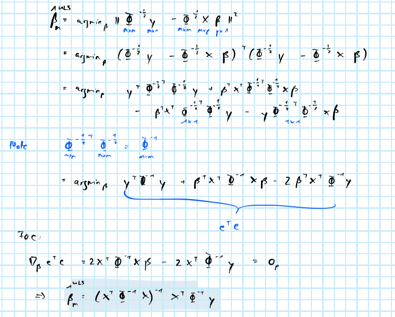

# Regression {#regr}

## Ordinary least-squares {#regr-ols}

Both OLS and WLS are implemented here using QR decomposition. As for OLS this is very easily done in R. Given some feature matrix `X` and a corresponding outcome variable `y` we can use `qr.solve(X, y)` to compute $\hat\beta$. 

## Weighted least-squares {#regr-wls}

For the weighted least-squares estimator we have: (see [appendix](#app-wls) for derivation)

$$
\begin{equation} 
\begin{aligned}
&& \hat\beta_m^{WLS}&= \left( \mathbf{X}^T \Phi^{-1} \mathbf{X} \right)^{-1} \mathbf{X}^T\Phi^{-1}\mathbf{y}\\
\end{aligned}
(\#eq:wls)
\end{equation}
$$

In R weighted this can be implemented as follows:

```{r class.source = "fold-show", code=fromScratchR::ols, echo=T, eval=F}
```


## Appendix

### Weighted least-squares {#app-wls}


