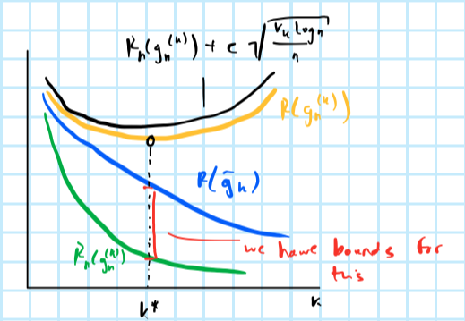

# VC theory {#vc}

In Chapter \@ref(emp) we defined the *shatter coefficient*  as the number of times we can intersect $\{X_1,...,X_n\}\in\mathcal{X}$ with subsets $A$ of $\mathcal{X}$ that belong to the family $\mathcal{A}$, in particular:

$$
\begin{equation} 
\begin{aligned}
&& S(X_1^n,\mathcal{A})&= \left|\{A\cup\{X_1,...,X_n\}:A\in\mathcal{A}\} \right| \\
\end{aligned}
(\#eq:shatter)
\end{equation}
$$

We further defined:

$$
\begin{equation} 
\begin{aligned}
&& S_{\mathcal{A}}(n)&=\max_{X_1,...,X_n}S(X_1^n,\mathcal{A}) \\
\end{aligned}
(\#eq:max-shatter)
\end{equation}
$$

Clearly, we have that $S(X_1^n,\mathcal{A})\le2^n$, where $2^n$ is simply the total number of subsets of $n$ points: each point can either be in a given subset or not. 

```{definition}
If $S(X_1^n,\mathcal{A})=2^n$, then we say that the class $\mathcal{A}$ shatters $\{X_1,...,X_n\}$.
```

Suppose the class $\mathcal{A}$ shatter the $n$ points. This means that for each possible subset, we can find a set in $\mathcal{A}$ that can be intersected with the subset. In the context of our initial problem $\mathbb{E}  \max_{A\in\mathcal{A}} |P_n(A)-P(A)|$ and the VC theorem, this means we are in trouble: we expect that overfitting will occur.

## VC dimension

```{definition}
Let $\mathcal{A}$ be a class if sets. The the VC dimension of $\mathcal{A}$ is the largest integer such that $S_{\mathcal{A}}(V)=2^V$. In other words, $V$ is the size of the largest set of points that can be shattered by $\mathcal{A}$. If $S_{\mathcal{A}}(n)=2^n$ for all $n$, then $V=\infty$. Note that $S_{\mathcal{A}}(V+1)<2^{V+1}$ in an upper bound for the VC dimension and also $S_{\mathcal{A}}(V+i)<2^{V+i}$ for all $i>1$.
```

Relating this back to empirical risk minimization and classification, the VC dimension corresponds to the complexity of our family $\mathcal{C}$ of classifiers. The higher the VC dimension, the higher the shatter coefficient associated with $\mathcal{C}$ for given $n$: ultimately, high VC dimensionality can be thought of as an increased risk of overfitting.

```{lemma, sauer, name="Sauer"}
For every class of sets $\mathcal{A}$, $S_{\mathcal{A}}(n)\le (n+1)^V$, that is the shatter coefficient is at most polynomial in $n$.
```

```{corollary, overfitting-vc, name="VC inequality"}
Given a class of classifiers $\mathcal{C}$ and its VC dimension $V$ we have that its expected maximal overfitting error can be bound as follows:

$$
\begin{aligned}
&& \mathbb{E}  \max_{g\in\mathcal{C}} |R_n(g)-R(g)|&\le 2 \sqrt{ \frac{2 V \log(n+1)}{n}
} \\
\end{aligned}
$$
```

### Feature maps

We often want to find an upper bound for the VC dimension of a family of classifiers. To do so in practice we just need to determine the number of feature maps $r$.

```{definition, name="Feature mapping"}
A feature mapping is just a fixed function of $X$ mapping from our feature space to the reals: $\phi: \mathcal{X}\mapsto \mathbb{R}$
```

```{theorem, lin-half-sp, name="Set of linear half-spaces"}
Let $\phi_1,...,\phi_r:\mathcal{X}\mapsto \mathbb{R}$ be feature mappings. Consider the class of set $\mathcal{A}$ defined by:

$$
\begin{aligned}
&& \mathcal{A}&=\left\{ \{ X: \sum_{i=1}^{r} w_i \phi_i(X)\ge0\}:w_1,...,w_r\in \mathbb{R}\right\} \\
\end{aligned}
$$

The VC dimension of this set is at most $r$: $V_{\mathcal{A}}\le r$
```

```{proof}
By definition of the VC dimension $V_{\mathcal{A}}\le r$ means that no set of size $r+1$ can be shattered by $\mathcal{A}$. So we just need to prove that for any set of $r+1$ points $X_1^{r+1}=\{X_1,...,X_{r+1}\}$ there exists a subset such that no set in $\mathcal{A}$ induces it. 

Fix $X_1,...,X_{r+1} \in \mathcal{X}$. We can defined a mapping $L: \mathbb{R}^r \mapsto \mathbb{R}^{r+1}$ by:

$$
\begin{aligned}
&& L(w_1,...,w_r)&= \left( \sum_{i=1}^{r} w_i \phi_i(X_1),...,\sum_{i=1}^{r} w_i \phi_i(X_{r+1})\right)\\
\end{aligned}
$$

Note that since $L$ is a linear transformation, the image of $L$ is at most an $r$-dimensional, linear subspace of $\mathbb{R}^{r+1}$ by the [Rank-nullity theorem](https://en.wikipedia.org/wiki/Rank%E2%80%93nullity_theorem) (in other words, while $L$ maps from the domain $\mathbb{R}^{r}$ to $\mathbb{R}^{r+1}$, the image of $L$ in its codomain is at most of dimension $r$).

But then there exists a vector $\gamma=(\gamma_1,...,\gamma_{r+1})\ne0$ such that $\gamma$ is orthogonal to $L(w_1,...,w_r)$ for all $(w_1,...,w_r)$. This means that for all $w_1,...,w_r$

$$
\begin{aligned}
&& \sum_{j=1}^{r+1}\gamma_j\sum_{i=1}^{r} w_i \phi_i(X_j)&=0 \\
\end{aligned}
$$

We may assume that $\gamma$ has at least one negative component and then rearrange

$$
\begin{equation} 
\begin{aligned}
&& \sum_{j:\gamma_j\ge0}^{}\gamma_j\sum_{i=1}^{r} w_i \phi_i(X_j)&=-\sum_{j:\gamma_j<0}^{}\gamma_j\sum_{i=1}^{r} w_i \phi_i(X_j) \\
\end{aligned}
(\#eq:pos-neg)
\end{equation}
$$

since by orthogonality the terms involving positive and negative components of $\gamma$ need to sum up to $0$. If the set of $r+1$ points $X_1^{r+1}=\{X_1,...,X_{r+1}\}$ was shattered, then there would exist $(w_1,...,w_r)$ such that $\{X:\sum_{i=1}^{r} w_i \phi_i(X)\ge0\}$ contains exactly those $X_j$ for which $\gamma_j\ge0$. But for this vector $(w_1,...,w_r)$ the left-hand side of \@ref(eq:pos-neg) is non-negative, while the right-hand side is negative. This is a contradiction.
```

### Examples

Firstly, observe that for the set of linear half-spaces $\mathcal{A}=\left\{ \{ X: \sum_{i=1}^{d} w_i \phi_i(X)=\mathbf{w}^T\phi(X)\ge0\}:\mathbf{w}\in \mathbb{R}^d\right\}$ we in fact have $V_{\mathcal{A}}=d$: we can simply take each element of $X$ as a feature, so $\phi_1(X)=X_1, ..., \phi_d(X)=X_d$.

```{example, name="Linear half-space with intercept"}
Consider $\mathcal{A}=\left\{ \{ X:w_0+ \mathbf{w}^T\phi(X)\ge0\}:w_0\in \mathbb{R}^d, \mathbf{w}\in \mathbb{R}^d\right\}$. Then we have $d+1$ feature mappings \phi_1(X)=X_1, ..., \phi_d(X)=X_d,\phi_{d+1}(X)=1$. We obtain $V_{\mathcal{A}}\le d+1$. In fact $V_{\mathcal{A}}=d+1$.
```

## Stuctural risk minimization

Let $\mathcal{C}^{(1)}\subset\mathcal{C}^{(2)}\subset...$ be a sequence of classifiers. Then for their corresponding VC dimensions we have $V_1\le V_2\le...$. Let $\bar{g}_k$ denote the best classifier among the whole sequence - that is the classifier that minimizes *true* risk - and let $g_n^{(k)}$ denote the classifier that minimizes *empirical* risk (potentially all the way to zero). We know that the empirical risk minimizer is prone to overfitting, but we also saw in Chapter \@ref(emp) that we can bound the risk of overfitting. In particular, using the result in \@ref(cor:overfitting-vc) we have that the overfitting error can be bound by

$$
\begin{aligned}
&& R(g_n^{(k)})-R_n(g_n^{(k)})&\le c \sqrt{ \frac{V_k \log n}{n}} \\
\end{aligned}
$$
where $c$ is some constant. We explicitly refrain from using absolute values here to demonstrate that we expect the difference expressed in this way to be positive. With this in mind, it seems reasonable to use this knowledge to inform our choice of $k$, that is the complexity of our classifier. In structural risk minimization we incorporate the bound as a penalty on top of the empirical risk. This is referred as complexity regulation.

```{definition}
```

Complexity regularization involves choosing the value of $k$ for which $R_n(g_n^{(k)})+c \sqrt{ \frac{V_k \log n}{n}}$ is minimized. Let $g_n$ denote the classifier obtained through penalized empirical risk minimization. Then one can prove that 

$$
\begin{aligned}
&&  \mathbb{E} R(g_n) - R^*&\le \min_k \left( c \sqrt{ \frac{V_k \log n}{n}} + R(\bar{g}_k) - R^*  \right)\\
\end{aligned}
$$

where $R^*$ is the Bayes risk, $c \sqrt{ \frac{V_k \log n}{n}}$ is an upper bound for the excess risk in $\mathcal{C}^{(k)}$ - that is $R(g_n^{(k)})-R(\bar{g}_k)$ - and $R(\bar{g}_k) - R^*$ is the approximation error (bias) of the family of classifiers that we restrict ourselves to. Figure \@ref(fig:struct-min-risk) illustrate this approach.

```{r struct-min-risk, fig.cap="(PLACEHOLDER) Structural risk minimization."}

```


Note that $c \sqrt{ \frac{V_k \log n}{n}}$ is not the best bound and in fact we have already seen improved versions of this, in particular the Rademacher Average in Chapter \@ref(emp). We will cover complexity regularization in more detail in Chapter \@ref(complex).


